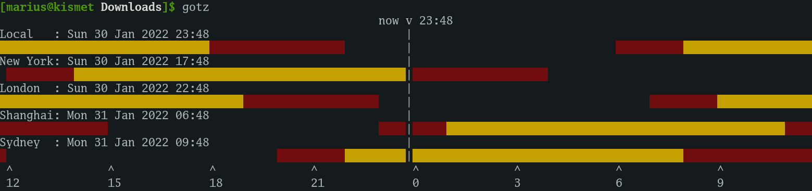
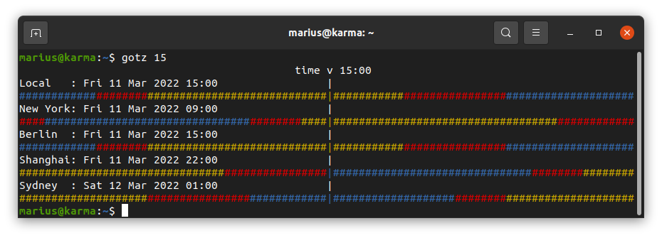

# go**tz**

A simple CLI timezone info tool.

## Installation

### Directly via [Go](https://go.dev/doc/install)

```bash
go install github.com/merschformann/gotz@latest
```

### Binary

Simply download the [binary](/merschformann/gotz/releases/latest/), rename it to `gotz` and put it in a folder in your `$PATH`.

Comfortable one-liner for most Linux and macOS systems (sudo required for writing to `/usr/local/bin`):

| OS | Command |
| --- | --- |
| Linux | `sudo wget -PN /usr/local/bin/ https://github.com/merschformann/gotz/releases/latest/download/gotz` |
| macOS | `sudo wget -PN /usr/local/bin/ https://github.com/merschformann/gotz/releases/latest/download/gotz` |

## Usage

Show current time:

```bash
gotz
```



Show arbitrary time:

```bash
gotz 15
```



Time can be one of the following formats:

```txt
15
15:04
15:04:05
3:04pm
3:04:05pm
3pm
1504
150405
2006-01-02T15:04:05
```

## Configure

TODO: Describe configuration options.
