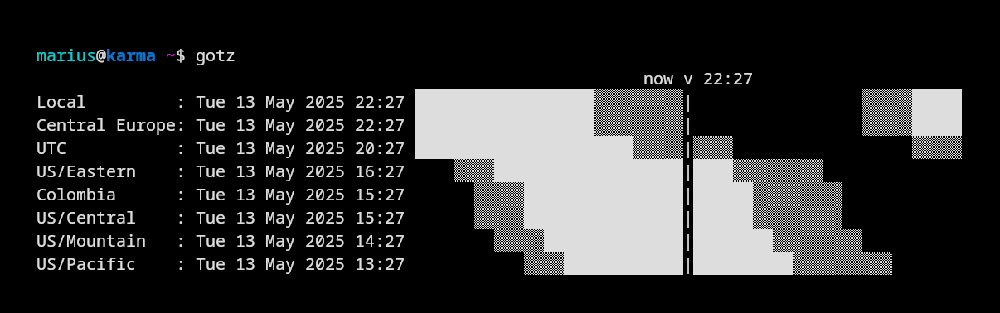

# gotz

go**tz** - a simple CLI timezone info tool.

## Installation

### Directly via [Go](https://go.dev/doc/install)

```bash
go install github.com/merschformann/gotz@latest
```

### Binary

Simply download the binary of the [latest release](https://github.com/merschformann/gotz/releases/latest/) (look for `gotz_OS_ARCH`), rename it to `gotz` and put it in a folder in your `$PATH`.

## Usage

Show current time:

```bash
gotz
```



Show arbitrary time:

```bash
gotz 15
```


Time can be one of the following formats:

```txt
15
15:04
15:04:05
3:04pm
3:04:05pm
3pm
1504
150405
2006-01-02T15:04:05
```

Use live mode to continuously update the time (exit via _q_, _esc_ or _ctrl+c_). Activate once via:

```bash
gotz --live true
```


## Basic configuration

Set the timezones to be used by default:

```bash
gotz --timezones "Office:America/New_York,Home:Europe/Berlin"
```

(lookup timezones in the [timezones](https://en.wikipedia.org/wiki/List_of_tz_database_time_zones) wiki page - _TZ database name_ column)

Set 12-hour format:

```bash
gotz --hours12 true
```

## Customization

The configuration is stored in `$HOME/.gotz.config.json`. It can be configured directly or via the arguments of the `gotz` command (see `gotz --help`). The configuration attributes are described in the following example:

```jsonc
{
    // Tracks the version of the configuration file (automatically written on creation)
    "config_version": "1.0",
    // Configures the timezones to be shown
    "timezones": [
        // Timezones have a name (Name) and timezone code (TZ)
        { "Name": "Office", "TZ": "America/New_York" },
        { "Name": "Home", "TZ": "Europe/Berlin" },
    ],
    // Configures the style of the plot
    "style": {
        // Select symbols to use for the time blocks (one of 'mono', 'rectangles' or 'sun-moon')
        "symbols": "mono",
        // Indicates whether to use coloring at all
        "colorize": true,
        // Configures how the day is segmented
        "day_segments": {
            // Hour of the morning to start (0-23)
            "morning": 6,
            // Hour of the day (business hours / main time) to start (0-23)
            "day": 8,
            // Hour of the evening to start (0-23)
            "evening": 18,
            // Hour of the night to start (0-23)
            "night": 22
        },
        // Defines the colors for the segments
        // Static mode colors can be one of:
        //  - >simple< color names like `red`, `green`, `cyan`, etc.
        //  - terminal color codes like `\u001b[34m`, `\u001b[32m`, etc.
        //  - hex codes like #DC143C, #00ff00, etc. (if true color is supported)
        // Dynamic mode colors 
        //  - tcell color names like crimson, green, etc.
        //  - hex codes like #DC143C, #00ff00, etc.
        "coloring": {
            // Color of the morning segment for static mode
            "StaticColorMorning": "#EC3620",
            // Color of the morning segment for static mode
            "StaticColorDay": "#F9C748",
            // Color of the morning segment for static mode
            "StaticColorEvening": "#EC3620",
            // Color of the morning segment for static mode
            "StaticColorNight": "#030D4D",
            // Foreground color overriding default for static mode (optional)
            "StaticColorForeground": "",
            // Color of the morning segment for dynamic mode
            "DynamicColorMorning": "#419AA8",
            // Color of the day segment for dynamic mode
            "DynamicColorDay": "#FFFFFF",
            // Color of the evening segment for dynamic mode
            "DynamicColorEvening": "#419AA8",
            // Color of the night segment for dynamic mode
            "DynamicColorNight": "#09293F",
            // Foreground color overriding default for dynamic mode (optional)
            "DynamicColorForeground": "",
            // Background color overriding default for dynamic mode (optional)
            "DynamicColorBackground": ""
        }
    },
    // Indicates whether to plot tics for the local time
    "tics": false,
    // Indicates whether to stretch across the full terminal width (causes inhomogeneous segment lengths)
    "stretch": true,
    // Indicates whether to colorize the blocks
    "hours12": false,
    // Indicates whether to use 12-hour format
    "live": false
}
```

## Why?

Working in an international team is a lot of fun, but comes with the challenge of having to deal with timezones. Since I am not good at computing them quickly in my head, I decided to write a simple CLI tool to help me out. I hope it can be useful for other people as well.
Thanks for the inspiration @[sebas](https://github.com/sebastian-quintero)!
